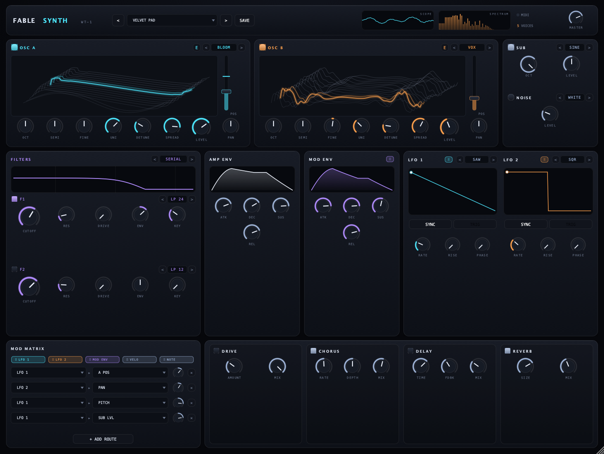
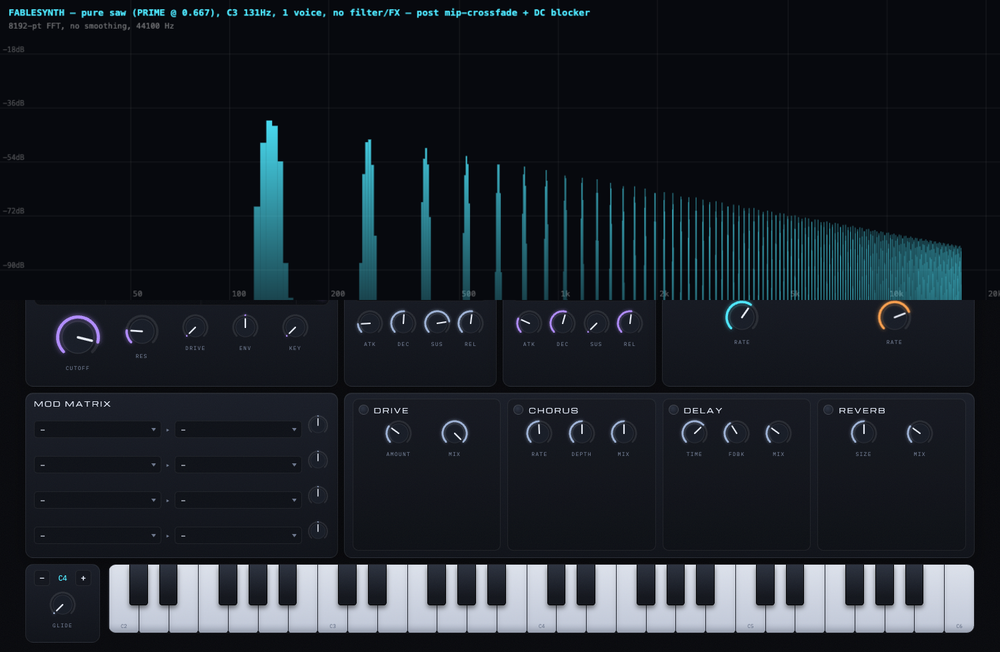
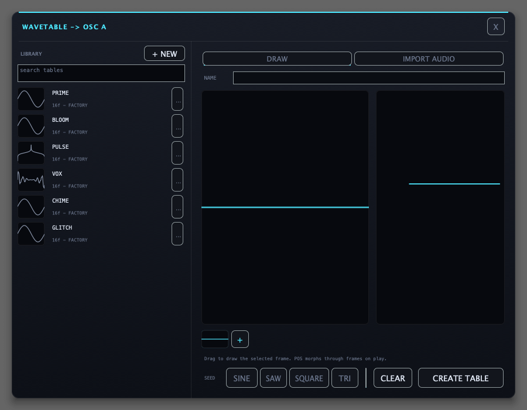
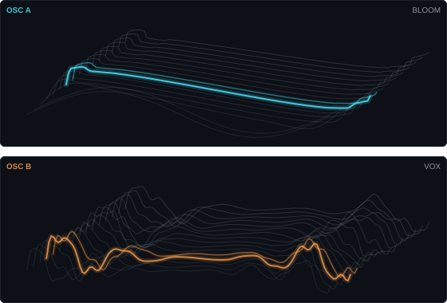
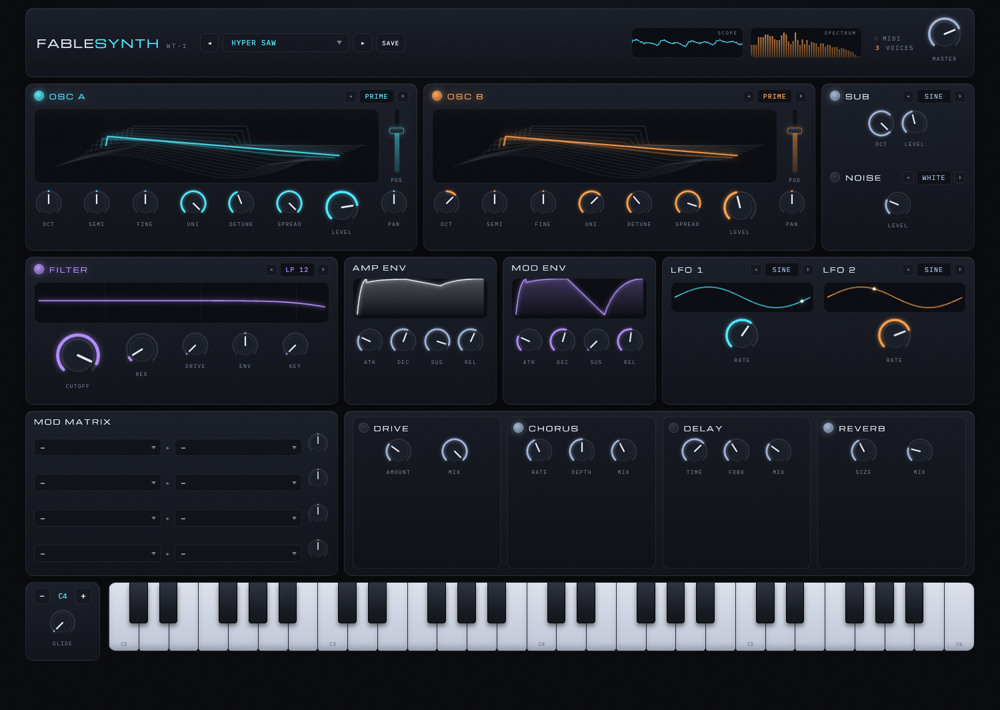
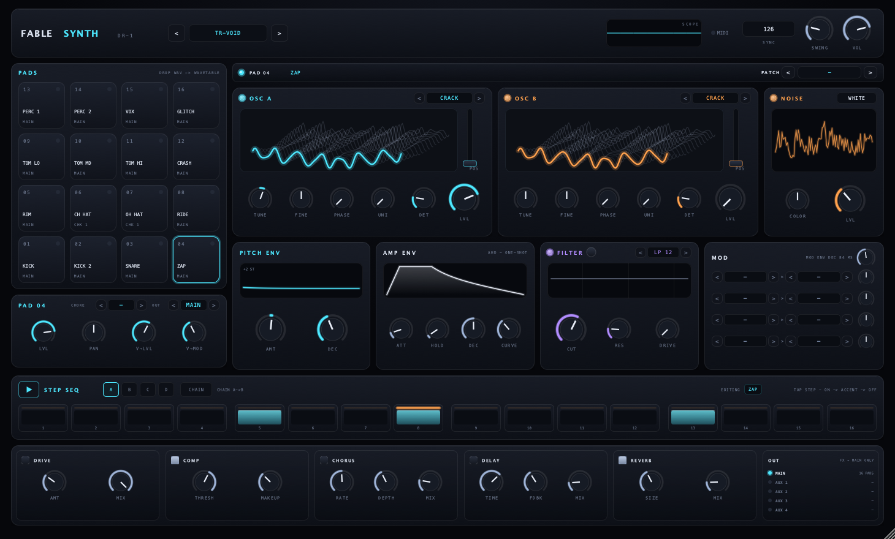
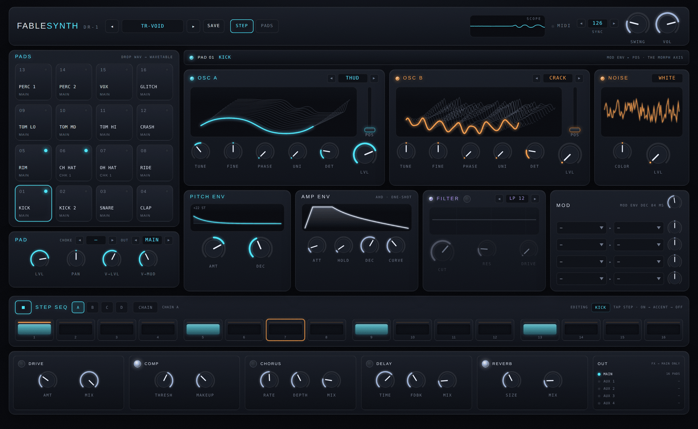
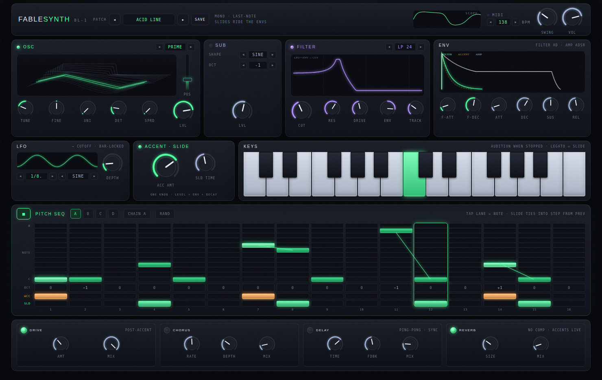

# FABLESYNTH WT‑1, DR-1 and BL-1

A Serum-style wavetable synthesizer plugin — **VST3 · AU · Standalone** for
macOS, Windows and Linux. Two morphing wavetable oscillators, a dual
zero-delay filter, deep modulation and a full FX rack, with a live 3D view of
the wavetable terrain. Built in C++ on JUCE.

[](juce/docs/plugin_editor.png)

## Download & install

Grab the zip for your platform from the
[**latest release**](https://github.com/georgi/fablesynth/releases/latest), then
drop the plugin in the right folder:

| Platform | VST3 | AU | Standalone |
| --- | --- | --- | --- |
| **macOS** | `~/Library/Audio/Plug-Ins/VST3/` | `~/Library/Audio/Plug-Ins/Components/` | drag the `.app` to Applications |
| **Windows** | `C:\Program Files\Common Files\VST3\` | — | run the `.exe` |
| **Linux** | `~/.vst3/` | — | run the binary |

The plugins ship as **FableSynth WT-1** (wavetable synth), **FableSynth
DR-1** (drum machine) and **FableSynth BL-1** (acid bassline) — separate zips
per platform.

Then rescan plugins in your DAW. macOS builds are **universal** (Apple Silicon +
Intel) and ad-hoc signed; on first launch you may need to right-click → Open, or
clear quarantine with `xattr -dr com.apple.quarantine <path>`.

> Building from source instead? See [`juce/README.md`](juce/README.md).

## Engine

- **2 wavetable oscillators** — 6 procedural tables (PRIME, BLOOM, PULSE, VOX,
  CHIME, GLITCH), each 16 morphable frames × 2048 samples. Tables are built from
  harmonic spectra and rendered into **9 band-limited mip levels** via inverse
  FFT, so high notes never alias (the same trick Serum uses). Mip transitions
  are **crossfaded** inside the 0.475·sr guard band, so glides and pitch bends
  never step in brightness — worst measured non-harmonic content is −92 dB:

  
- **User wavetables** — import an audio file (single-cycle, autocorrelation pitch
  **auto-detect**, or fixed cycle length — sliced into 2048-sample frames with
  resampling) or **draw** a single cycle. Every imported/drawn frame runs through
  the *same* FFT band-limit + 9-level mip pipeline as the procedural tables
  (`buildUserTable`), so they anti-alias identically. The import/draw editor (the
  **✎** button on each oscillator) is available in **both** the web app and the
  plugin; in the VST, user tables are saved with the plugin/DAW project state.

  
- **Unison** up to 7 voices per oscillator with detune + stereo spread,
  octave/semi/fine tuning, level and pan per oscillator.
- **Sub oscillator** (sine / polyblep square, −1/−2 oct) and **noise** (white/pink).
- **Dual per-voice filter** — two independent filters, each offering the Simper
  (Cytomic) zero-delay state-variable types (LP12, LP24, BP, HP, Notch) plus a
  tuned **comb** (CUTOFF sets pitch, RES sets feedback) and a **vowel/formant**
  filter (CUTOFF morphs A-E-I-O-U), all with envelope amount and key tracking.
  They route **serial** (F1→F2), **parallel** (summed) or **split** (osc A→F1,
  osc B→F2). The `tanh` drive is **anti-aliased** (first-order antiderivative
  anti-aliasing, ADAA), so pushing DRIVE on bright material doesn't fold
  harmonics back down the way a naive per-sample saturator would.
- **2 ADSR envelopes** (amp + mod), **2 LFOs** (5 shapes) and **Serum-style mod
  assignment** — drag any source (LFOs / mod env / velocity / note) straight onto
  a knob or the wavetable POS slider to create a route, then drag the colored
  ring it grows to set the depth. Each control can carry several routes, and the
  mod matrix lists every connection (including the global pitch / amp / pan
  targets) for direct editing. Destinations: wavetable position, F1/F2 cutoff, F2
  resonance, pitch, amp, pan, osc levels.
- **8-voice polyphony** with smart voice stealing, glide, pitch-bend, and a
  per-voice DC blocker so saturation stages never see offset.
- **FX chain** — tanh drive, stereo chorus, ping-pong delay, reverb, safety
  limiter.
- Live **3D wavetable views** show the actual modulated frame position streamed
  back from the DSP thread, plus oscilloscope, spectrum analyser and filter
  response displays.

The live 3D wavetable terrain for both oscillators (the highlighted line is the
frame currently playing, tracked from the DSP thread):



## The web prototype

FableSynth started as a synth that runs **entirely in the browser** — the
oscillators, filters and modulation are an AudioWorklet DSP core in TypeScript,
the rack is React + Zustand with custom dependency-free UI. The plugin is a
faithful C++/JUCE port of that engine: the DSP is reimplemented one-to-one as
JUCE-independent pure C++, with the same parameters, the same 20 factory presets
and the same signal flow, so a patch sounds the same in either.

The web app is still the place to **import and draw user wavetables**, and it's
the quickest way to try the synth with nothing to install:

[](https://github.com/georgi/fablesynth/raw/main/docs/fablesynth.mp4)

https://github.com/user-attachments/assets/0855c756-2155-4dd3-b353-fe80abd48db9

```sh
cd fablesynth
npm install
npm run dev
# open the printed http://localhost:5173
```

`npm run build` produces a static bundle in `dist/` (`npm run preview` serves it).
AudioWorklet requires a real HTTP origin (not `file://`), which the dev/preview
servers provide. Click the power button (also the browser audio-unlock gesture)
and play.

| Input | Action |
| --- | --- |
| Knobs | drag vertically · `shift` = fine · double-click = reset · scroll wheel |
| Computer keys | `A W S E D F T G Y H U J K O L P ; '` play notes · `Z`/`X` octave |
| `Esc` | panic (all notes off, stops the sequencer) |
| MIDI | plug in a controller — notes + pitch bend (Chrome/Edge) |
| On-screen keys | click/touch, vertical position = velocity, drag for glissando |

The web rack also carries a **16-step note sequencer** (the NOTE SEQ panel,
web-only for now): 12 note lanes per step with per-step octave (−1/0/+1),
**accents** (full velocity — route VELO in the mod matrix to make them bite)
and **ties** (legato retune of the sounding voice, no envelope retrigger; turn
up GLIDE and a tie becomes a slide). Four patterns A–D with chaining, swing,
gate length, a root-note stepper and RAND — the same workflow as the DR-1 and
BL-1 sequencers, driving the full polyphonic engine. Synced LFOs lock to the
sequencer tempo, and patterns persist in `localStorage`. This is the WT-1
half of the groundwork for the FableSeq SQ-4 session launcher.

## DR-1 drum machine

DR-1 is a 16-pad drum machine built on the same wavetable engine. Every sound
is **fully synthesized, no samples**: each pad is a complete drum voice you can
retune, reshape or mangle. It comes in two forms:

- **Plugin** — **FableSynth DR-1** (VST3 · AU · Standalone), a faithful
  C++/JUCE port built from the same [`juce/`](juce/) project as WT-1, adding
  real **5-bus multi-out** (MAIN + AUX 1–4 as separate DAW mixer channels),
  **host tempo sync**, and **drop-WAV pad import** saved with the project
  state. See [`juce/README.md`](juce/README.md#fablesynth-dr-1--drum-machine).
- **Web app** — served at `/drum/` (`npm run dev`, then open
  `http://localhost:5173/drum/`).

[](juce/docs/drum_editor.png)

The web build:



- **16 pads**, each with **2 wavetable oscillators** (4 drum tables — THUD,
  CRACK, TINE, GRIT — plus WT-1's six procedural tables, with the same POS
  morphing and up to 7-voice unison) and a **noise** layer with color control.
- **Per-pad shaping** — pitch envelope (±48 st), AHD amp envelope with
  adjustable curve, a switchable filter (LP12/LP24/BP/HP/Notch) with drive, and
  a **4-slot mod matrix** (MOD ENV / VELO / RAND → wavetable pos, pitch, cutoff,
  levels …). Velocity→level and velocity→mod amounts per pad.
- **Drop a WAV on a pad** and it's sliced into a wavetable through the same
  band-limit pipeline as WT-1 user tables — any sample becomes a synthesized,
  retunable drum.
- **16-step sequencer** — tap steps through off → on → accent, 4 patterns (A–D)
  per kit with **pattern chaining**, swing, and 60–200 BPM.
- **Choke groups** (4) so open/closed hats cut each other, and per-pad output
  routing (MAIN + 4 aux buses).
- **Master FX** — drive, bus compressor, chorus, delay, reverb.
- **Kits** — 3 factory kits (TR-VOID, ROOM ONE, BITCRUSH); saved kits persist in
  `localStorage`, including patterns, chains and any dropped-in wavetables.
- **Play it** — pads map to `Z X C V / A S D F / Q W E R / 1 2 3 4` (bottom row
  = pads 1–4), `Esc` stops, and MIDI notes 36–51 (C1 up) trigger pads 1–16.

## BL-1 acid bassline

BL-1 is a monophonic acid bassline machine built on the same wavetable
engine — one last-note-priority voice with the classic 303 interplay of
**accents** (one knob boosts level, filter-env peak and shortens its decay)
and **slides** (tied steps glide the pitch while both envelopes keep
running). Two builds from one source of truth:

- **Web app** — served at `/bass/` (`npm run dev`, then open
  `http://localhost:5173/bass/`).
- **Plugin** — **FableSynth BL-1** (VST3 · AU · Standalone), a faithful
  C++/JUCE port of the same engine with host tempo sync and transport lock
  (the DAW playhead drives the pitch sequencer sample-accurately), MIDI
  audition of the mono voice, and the factory patches as host programs. Ships
  from the same build as WT-1/DR-1 — see
  [`juce/README.md`](juce/README.md#fablesynth-bl-1--acid-bassline-synth).



- **One wavetable oscillator** (WT-1's six procedural tables with POS
  morphing and up to 7-voice unison with stereo spread) over a **sub
  oscillator** (sine / polyblep square, −1/−2 oct).
- **Zero-delay SVF filter** (LP12/LP24/BP/HP/Notch, LP 24 default) with ADAA
  drive, resonance, key tracking and a snappy **AD filter envelope** (±5
  octaves of sweep); amp is a full **ADSR**.
- **Bar-locked LFO → cutoff** — synced divisions (1/1 … 1/32, dotted &
  triplet), 5 shapes, phase locked to the sequencer transport.
- **16-step pitch sequencer** — tap one of 12 note lanes per step, per-step
  octave (−1/0/+1), accent and slide rows, glowing slide connectors, 4
  patterns (A–D) with **chaining**, swing, RAND pattern generator, 60–200
  BPM.
- **FX** — post-accent drive, chorus, ping-pong delay, reverb. Deliberately
  no bus compressor: accents stay live.
- **Patches** — 3 factory patches (ACID LINE, RUBBER SUB, NEON SQUELCH);
  saved patches (sound + patterns + chain) persist in `localStorage`.
- **Play it** — two-octave on-screen keyboard (audition when stopped,
  overlapping keys = legato slide), computer keys `A W S E D …` with `Z`/`X`
  octave, `Esc` stops, MIDI in from C2 with last-note priority.

## SQ-4 session launcher

SQ-4 is a session clip launcher in the spirit of Ableton's Session View: four
tracks (DRUMS · BASS · LEAD · PADS, each badged with the FableSynth machine it
represents) crossed with six scenes (INTRO → OUTRO). Tap a clip to launch it,
tap again to stop; scenes layer freely and the latest launch wins each track.
Launches quantize to the beat clock (**1 BAR**, **1/4** or **OFF**) — queued
clips pulse until the boundary, then take ownership atomically. Per-track
mute/solo, per-scene mute, a master SUM scope and per-track VU meters round
out the surface. It is currently UI-only — a performance front end with the
full launcher state machine, not yet wired to the instrument engines.

- **Web app** — served at `/seq/` (`npm run dev`, then open
  `http://localhost:5173/seq/`).

## Code layout

The **plugins** (C++/JUCE — WT-1, DR-1 and BL-1) live in [`juce/`](juce/) — see
[`juce/README.md`](juce/README.md) for the DSP/UI source maps and the headless
verification harnesses.

The **web prototype** (TypeScript):

```
src/engine/worklet.js      DSP core (AudioWorklet thread): voices, oscillators,
                           filter, envelopes, LFOs, mod matrix
src/engine/wavetables.ts   FFT + procedural wavetable/mipmap generation
                           (+ buildUserTable: shared band-limit for user tables)
src/engine/usertables.ts   user wavetables: audio import (resample, autocorr
                           cycle detect), draw mode, base64-Float32 (de)serialize
src/engine/synth.ts        AudioContext, FX graph, param routing
src/components/WavetableEditor.tsx  import / draw modal
src/params.ts              single source of truth for every parameter
src/presets.ts             factory + localStorage user presets
src/noteseq.ts             16-step note-sequencer data model + timing math
src/store.ts               Zustand store: param state + transport, engine glue
src/components/            knobs, steppers, sliders, keyboard, canvas displays
src/components/panels/     the rack layout (oscillators, filter, env, fx, …)
src/hooks/                 computer-keyboard + MIDI input
src/App.tsx                top-level composition
```

The **DR-1 drum machine** (TypeScript, third vite entry at `drum/index.html`):

```
src/drum/engine/worklet-drum.js  DSP core (AudioWorklet thread): 16 one-shot pad
                                 voices, sample-accurate sequencer, choke groups
src/drum/engine/drumtables.ts    the 4 drum wavetables (THUD, CRACK, TINE, GRIT)
src/drum/engine/drum-synth.ts    AudioContext, drum worklet + master FX graph
src/drum/params.ts               canonical per-pad + global parameter table
src/drum/seq.ts                  pattern data model + swing/step timing math
src/drum/kits.ts                 factory kits + localStorage user kits
src/drum/store.ts                Zustand store: params, patterns, chain, transport
src/drum/components/             pads, panels, step sequencer, FX rack
src/drum/hooks/                  computer-keyboard + MIDI pad input
```

The **BL-1 bassline** (TypeScript, fourth vite entry at `bass/index.html`):

```
src/bass/engine/worklet-bass.js  DSP core (AudioWorklet thread): mono acid voice
                                 (osc + sub + SVF + envs + accent/slide),
                                 sample-accurate pitch sequencer, synced LFO
src/bass/engine/bass-synth.ts    AudioContext, bass worklet + master FX graph
src/bass/params.ts               canonical parameter table
src/bass/seq.ts                  pitch pattern data model (note/oct/acc/slide)
src/bass/patches.ts              factory patches + localStorage user patches
src/bass/store.ts                Zustand store: params, patterns, chain, transport
src/bass/components/             osc/filter/env panels, keys, pitch seq, FX rack
src/bass/hooks/                  computer-keyboard + MIDI note input
```

The **SQ-4 session launcher** (TypeScript, fifth vite entry at `seq/index.html`):

```
src/seq/model.ts                 tracks/scenes data + pure launcher rules
                                 (quantize queue, ownership, audibility)
src/seq/store.ts                 Zustand store: beat clock, launch queue, mutes
src/seq/components/              top bar, track heads, scene rows, clip cells,
                                 now-playing footer, SUM scope, knobs
```
