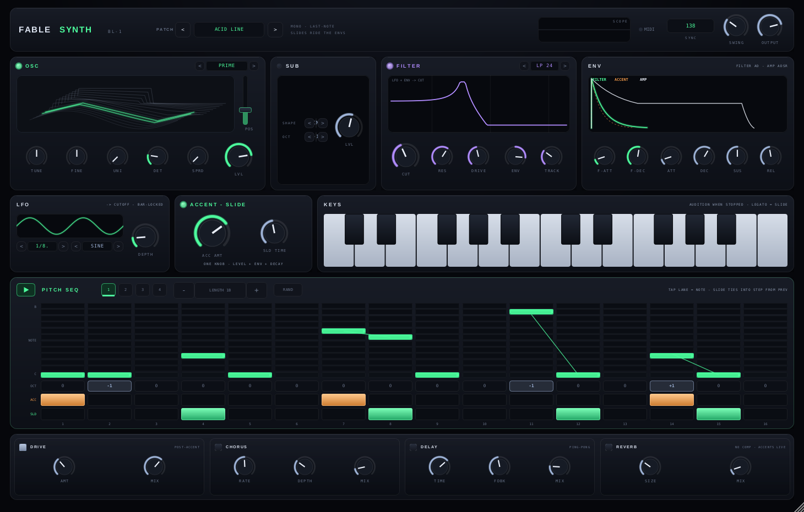

# FableSynth WT-1 — JUCE / C++ port (VST3 · AU · Standalone)

A faithful C++/JUCE port of the FableSynth web wavetable synth. The DSP core
is reimplemented one-to-one from the AudioWorklet engine; the parameters,
presets and signal flow match the web build so a patch sounds the same.

The same CMake project also builds **FableSynth DR-1**, the 16-pad drum
machine — see [FableSynth DR-1](#fablesynth-dr-1--drum-machine) — and
**FableSynth BL-1**, the acid bassline synth — see
[FableSynth BL-1](#fablesynth-bl-1--acid-bassline-synth) below.


The live 3D wavetable terrain for both oscillators (the highlighted line is the
frame currently playing, tracked from the DSP thread):


> Both images are rendered headlessly by `plugin_host_test` via JUCE's software
> renderer (`./plugin_host_test <output-dir>`), so they always reflect the
> current build.

## Architecture

The DSP is **JUCE-independent pure C++** so it can be unit-tested headless and
isn't coupled to the plugin framework. JUCE only provides the plugin shell
(APVTS parameters, MIDI, the editor).

```
source/dsp/Wavetables.{h,cpp}  FFT + 6 procedural tables + 9-level band-limited
                               mip pyramid + buildUserTable   (port of wavetables.ts)
source/dsp/Engine.{h,cpp}      8-voice engine: 2 morphing oscillators (unison),
                               sub + noise, dual SVF/comb/vowel filter with ADAA
                               drive, 2 ADSR, 2 LFO, 4-slot mod matrix, glide,
                               voice stealing, and the sample-accurate 16-step
                               note sequencer             (port of worklet.js)
source/dsp/NoteSeq.h           packed pattern model (3 bytes/step x 16 x A-D)
                               shared by engine/plugin/tests (port of noteseq.ts)
source/dsp/Fx.{h,cpp}          drive -> chorus -> ping-pong delay -> reverb ->
                               master gain -> DC block -> limiter (port of synth.ts)
source/dsp/Params.{h,cpp}      single source of truth for every parameter
                               (port of params.ts) — drives APVTS + defaults
source/dsp/Presets.{h,cpp}     20 factory presets        (port of presets.ts)
source/PluginProcessor.{h,cpp} JUCE AudioProcessor + APVTS <-> engine bridge
source/PluginEditor.{h,cpp}    the rack: scaled, pixel-faithful CSS-grid layout
source/WavetableView.{h,cpp}   live 3D wavetable terrain (port of WavetableView.tsx)
source/ui/Theme.h              palette + panel drawing (port of index.css :root)
source/ui/Controls.{h,cpp}     knob / stepper / power LED / vertical slider
source/ui/Displays.{h,cpp}     scope, spectrum, filter, env + LFO views
source/ui/Panels.{h,cpp}       osc / util / filter / env / lfo / matrix / fx / top bar
source/ui/NoteSeqView.{h,cpp}  NOTE SEQ panel: 12 lanes x 16 steps, oct/acc/tie
                               rows, patterns A-D + chain, RAND, BPM/SWING/GATE/
                               ROOT clock            (port of SeqPanel.tsx .ns-*)
test/engine_test.cpp           headless DSP verification harness (no JUCE)
test/plugin_host_test.cpp      plugin-boundary test + PNG snapshot of the editor
```

## User interface

The editor is an exact replica of the web rack (`src/components`, `src/index.css`):
the same dark machined-hardware panels, cyan/amber/violet accents, custom rotary
knobs (−135°→135° arc, bipolar from centre), enum steppers, power LEDs, the
wavetable POS slider with modulated ghost, the mod-matrix selectors and the FX
rack. Every visualization is ported too — the live oscilloscope and spectrum
analyser (fed from a post-FX ring buffer), the filter-response curve, the ADSR
and LFO views, and the 3D wavetable terrain. The whole rack is laid out at a
fixed logical size matching the CSS grid and scaled to the plugin window, so it
stays pixel-faithful at any size.

### Mapping notes
- **Parameters** use a flat float array indexed by an enum (no string hashing in
  the audio thread). The APVTS `NormalisableRange` uses the *same* value<->norm
  curve functions as the web app, so log/int knobs map identically.
- **Oscillators / filters / envelopes / LFOs / mod matrix** are a direct port of
  `worklet.js`, including the Serum-style crossfaded mip selection, the Cytomic
  SVF, the tuned comb and the A-E-I-O-U vowel bank, and the ADAA `tanh` drive.
- **FX**: WebAudio native nodes don't exist outside the browser, so each stage is
  reimplemented. Drive is a 2x-oversampled `tanh` shaper; chorus and ping-pong
  delay are direct ports. The web build's **convolution reverb** (generated
  exponential-noise impulse) is approximated by a Freeverb network tuned by SIZE
  — a real-time-safe stand-in with an equivalent diffuse tail.
- **Note sequencer** (port of the web NOTE SEQ panel + the worklet's
  seqFire/seqTie/seqGateOff): 16 steps x 4 chained patterns firing into the
  polyphonic voice allocator; a *tie* retunes the sounding voice legato — no
  envelope retrigger, GLIDE decides snap vs slide; accents fire velocity
  1.0 vs 0.72 so VELO mod routes respond; the gate closes at the GATE fraction
  of the step unless the next step ties in; swing delays odd 16ths by
  swing * 0.667 of a step. **Host transport lock** mirrors DR-1/BL-1: when the
  host transport rolls (reporting tempo + song position), steps derive from the
  playhead ppq sample-accurately and host stop stops the line; a reported tempo
  always overrides `seq.bpm`; otherwise the panel's play button drives the
  internal sample-counting clock (Standalone included), and synced LFOs
  phase-lock to the sequencer tempo like the web's virtual transport. All 4
  patterns (the web's packed 3-byte/step layout), the chain and the edit
  pattern persist in the plugin state.

## Build

JUCE Linux deps (Debian/Ubuntu):
```sh
sudo apt-get install -y libasound2-dev libx11-dev libxext-dev libxinerama-dev \
  libxrandr-dev libxcursor-dev libfreetype6-dev libfontconfig1-dev libgl1-mesa-dev
```

Configure + build (JUCE 8.0.4 is fetched automatically; pass
`-DJUCE_DIR=/path/to/JUCE` to use a local checkout / build offline):
```sh
cd juce
cmake -B build -G Ninja -DCMAKE_BUILD_TYPE=Release
cmake --build build
```

One build produces all three plugins: WT-1 artifacts land in
`build/FableSynth_artefacts/Release/`, DR-1 artifacts in
`build/FableDrum_artefacts/Release/` and BL-1 artifacts in
`build/FableBass_artefacts/Release/` (`VST3/`, `AU/`, `Standalone/` each).

## Verify the audio engine

The headless harness builds without JUCE and checks wavetable correctness, that
a note produces audio, the anti-aliasing floor, every filter type, the FX chain,
all 20 presets, and the note sequencer (sample-exact step positions, accent
velocities 1.0/0.72, tie-without-retrigger, gate fraction, swing timing, chain
wrap and the host transport lock):
```sh
cd juce
g++ -std=c++17 -O2 -o engine_test test/engine_test.cpp \
  source/dsp/Engine.cpp source/dsp/Wavetables.cpp source/dsp/Fx.cpp \
  source/dsp/Params.cpp source/dsp/Presets.cpp source/dsp/UserTables.cpp
./engine_test
# or: cmake --build build --target engine_test && ctest --test-dir build
```

## Wavetable visualization
The editor shows the signature **live 3D wavetable terrain** for both
oscillators (`WavetableView`, a port of `WavetableView.tsx`): every frame drawn
in perspective with the currently-playing, modulated frame highlighted. The DSP
thread publishes the smoothed modulated frame position per oscillator via
atomics (`Engine::vizA/vizB` -> `FableAudioProcessor::getVizPos`), which the
view reads on a 30 Hz timer (falling back to the POS knob when idle). The
plugin-boundary test renders both views to a PNG headlessly to verify drawing.

## Not ported (web-only)
User-wavetable **audio import / draw** modal (the `buildUserTable` band-limit
pipeline *is* ported and ready) and the on-screen keyboard / power-on overlay —
these are browser-input concerns; the plugin receives notes from the host.

---

# FableSynth DR-1 — drum machine

A faithful C++/JUCE port of the DR-1 web drum machine (`src/drum/`, the
lockstep reference): 16 fully synthesized pads — two morphing wavetable
oscillators plus noise per pad, no samples — a 16-step sequencer with pattern
chaining, choke groups, master FX, and the three factory kits. Ships as a
second plugin from the same build: **VST3 · AU · Standalone**, product name
"FableSynth DR-1".


> Rendered headlessly by `drum_host_test` via JUCE's software renderer
> (`./drum_host_test <output-dir>`), so it always reflects the current build.

## What the plugin adds over the web build

- **Real 5-bus multi-out** — the plugin declares five stereo output buses
  (MAIN + AUX 1–4). Each pad's OUT selector routes it to a bus for separate
  processing in the DAW mixer; master FX run on MAIN only, exactly like the
  web routing. Hosts that only take stereo just use MAIN.
- **Host transport lock** — when the host transport rolls (and reports tempo
  + song position), the sequencer is slaved to the playhead: steps derive
  from PPQ, so mid-bar starts, loops and relocates land sample-accurately,
  the pattern chain follows the host bar index, and host stop stops the
  sequencer. The header shows SYNC and the internal play button yields while
  the host owns the clock. With the host stopped (or tempo-only hosts, or
  Standalone) DR-1's own play button and BPM knob drive the internal clock.
- **Drop-WAV pad import** — drop an audio file on a pad and it's sliced into a
  wavetable through the *same* `buildUserTable` band-limit + mip pipeline as
  WT-1 user tables, then assigned to that pad's OSC A. Imported tables are
  saved in the plugin/DAW project state.
- **Kit programs** — TR-VOID / ROOM ONE / BITCRUSH are exposed as host
  programs, so DAWs can switch kits natively.

## Architecture

Same split as WT-1: a **JUCE-independent pure C++** DSP core under
`source/drum/dsp/` (namespace `fable`, headless-testable with bare `g++`),
wrapped by a thin processor and a pixel-faithful editor. Shared infrastructure
(`Params`, `Wavetables`, `UserTables`, the `Fx.h` building blocks, the `fui::`
controls and theme) is reused from the WT-1 sources, never copied.

```
source/drum/dsp/DrumParams.{h,cpp}  788-param definition table: 16 pads x 48
                                    fields + sequencer/FX globals (port of
                                    src/drum/params.ts)
source/drum/dsp/DrumTables.{h,cpp}  THUD/CRACK/TINE/GRIT drum wavetables via the
                                    shared band-limit pipeline (drumtables.ts)
source/drum/dsp/DrumEngine.{h,cpp}  16 one-shot pad voices: 2 morphing wavetable
                                    oscillators (unison) + noise, pitch/AHD amp/
                                    mod envelopes, switchable SVF with drive,
                                    4-slot mod matrix, choke groups, and the
                                    sample-accurate swing sequencer with 5-bus
                                    routing                (port of worklet-drum.js)
source/drum/dsp/DrumFx.{h,cpp}      drive -> bus compressor -> chorus -> ping-pong
                                    delay -> reverb -> DC block -> limiter, on
                                    MAIN only              (port of drum-synth.ts)
source/drum/dsp/DrumKits.{h,cpp}    TR-VOID / ROOM ONE / BITCRUSH (port of kits.ts)
source/drum/DrumProcessor.{h,cpp}   JUCE AudioProcessor: APVTS, 5 stereo buses,
                                    MIDI pads (notes 36-51), host tempo sync, kit
                                    programs, full session state (patterns, chain,
                                    pad names, imported wavetables)
source/drum/DrumEditor.{h,cpp}      the rack shell — fixed 1460x880 logical grid,
                                    scaled to the window (port of the CSS layout)
source/drum/ui/DrumHeader.*         kit stepper, scope, BPM + SYNC, swing/volume
source/drum/ui/PadGrid.*            4x4 pad grid: click/QWERTY audition, hit LEDs,
                                    drop-WAV import target
source/drum/ui/PadStrip.*           per-pad LVL/PAN/V-LVL/V-MOD + choke/out steppers
source/drum/ui/DrumPanels.*         osc A/B terrains, noise, pitch/amp env, filter,
                                    mod matrix — rebound live to the selected pad
source/drum/ui/StepSeqView.*        16-step lane, patterns A-D, chain builder,
                                    playhead + accent states
source/drum/ui/DrumFxRack.*         master FX rack + OUT bus routing summary
test/drum_engine_test.cpp           headless DSP verification harness (no JUCE)
test/drum_host_test.cpp             plugin-boundary test (buses, MIDI, sync, state,
                                    kits, UI) + PNG snapshot of the editor
```

### Mapping notes

- **Web constants are exact**: plain/accent velocities 0.72/1.0, swing max
  0.667, choke fade coefficient 0.12, 16-sample mod subblocks, the 10-entry table order
  (THUD CRACK TINE GRIT + the six WT-1 tables), and the same value<->norm
  curves in the APVTS as the web knobs.
- **Bus compressor**: WebAudio's `DynamicsCompressorNode` doesn't exist
  outside the browser, so it's reimplemented to the node's spec semantics —
  ratio 4, soft knee 9 dB, attack 3 ms, release 250 ms, and the spec's
  implicit makeup gain — driven by the THRESH/MAKEUP knobs.
- **Reverb**: the web build's convolution reverb (generated exponential-noise
  impulse) is approximated by the same Freeverb network as WT-1, tuned by
  SIZE — real-time-safe with an equivalent diffuse tail.

## Build & verify

Built by the same configure/build as WT-1 (above). Artifacts:
`build/FableDrum_artefacts/Release/{VST3,AU,Standalone}/` →
`FableSynth DR-1.vst3` / `.component` / `.app`.

The headless harness builds without JUCE — proof the DSP core stays
JUCE-free — and checks the parameter table, drum wavetables, every pad voice
stage, the sequencer/swing/choke math, the FX chain and all three kits:
```sh
cd juce
g++ -std=c++17 -O2 -o drum_engine_test test/drum_engine_test.cpp \
  source/drum/dsp/*.cpp source/dsp/Fx.cpp source/dsp/Wavetables.cpp \
  source/dsp/UserTables.cpp source/dsp/Params.cpp
./drum_engine_test   # -> ALL PASS
```

The plugin-boundary test drives the real `DrumAudioProcessor` the way a DAW
would (5-bus layout, MIDI pads, AUX routing, host-tempo playhead, state
round-trip, kit programs) and renders the editor snapshot above:
```sh
cmake --build build --target drum_host_test
ctest --test-dir build --output-on-failure   # runs all 6 test targets
```

---

# FableSynth BL-1 — acid bassline synth

A faithful C++/JUCE port of the BL-1 web bassline machine (`src/bass/`, the
lockstep reference): one mono last-note-priority acid voice — morphing
wavetable oscillator with unison + stereo spread, sine/square sub, SVF filter
with ADAA drive, filter AD env with accent boost, amp ADSR, slide (one-pole
glide), bar-locked LFO → cutoff — driven by a 16-step pitch sequencer with
per-step octave / accent / slide and pattern chaining. Ships as a third
plugin from the same build: **VST3 · AU · Standalone**, product name
"FableSynth BL-1".



> Rendered headlessly by `bass_host_test` via JUCE's software renderer
> (`./bass_host_test <output-dir>`), so it always reflects the current build.

## What the plugin adds over the web build

- **Host transport lock** — same contract as DR-1: when the host transport
  rolls (tempo + song position reported), the pitch sequencer is slaved to
  the playhead. Steps derive from PPQ (swing shifts odd 16ths late in the
  PPQ domain), the chain follows the host bar index, gate ties and slides
  land sample-accurately across loops and relocates, and host stop stops the
  line. Tempo-only hosts override BPM; Standalone uses the internal clock.
- **MIDI audition** — MIDI notes drive the same mono last-note/legato voice
  path as the on-screen keyboard (root C2 = note 36); overlapping notes
  slide. While the sequencer plays, it owns the voice — exactly the web rule.
- **Patch programs** — ACID LINE / RUBBER SUB / NEON SQUELCH are exposed as
  host programs (a patch is params + patterns + chain, like the web).

## Architecture

Same split as WT-1/DR-1: a **JUCE-independent pure C++** DSP core under
`source/bass/dsp/` (namespace `fable`, headless-testable with bare `g++`),
wrapped by a thin processor and a pixel-faithful editor. Shared
infrastructure (`Params` curves, `Wavetables`, the `Fx.h` building blocks,
the `fui::` controls and theme) is reused from the WT-1 sources, never
copied. The editor re-themes the shared accent A to the BL-1 acid green the
same way the web overrides `--ac-a`.

```
source/bass/dsp/BassParams.{h,cpp}   45-param definition table — flat ids, one
                                     mono voice           (port of src/bass/params.ts)
source/bass/dsp/BassEngine.{h,cpp}   the acid voice + sample-accurate pitch
                                     sequencer: patterns/chain/swing, 303 gate
                                     frac 0.55, slide ties, accent env boost,
                                     bar-locked LFO       (port of worklet-bass.js)
source/bass/dsp/BassFx.{h,cpp}       drive -> chorus -> ping-pong delay -> reverb
                                     -> DC block -> limiter — no bus compressor,
                                     accents live          (port of bass-synth.ts)
source/bass/dsp/BassPatches.{h,cpp}  packed 3-byte step codec + ACID LINE /
                                     RUBBER SUB / NEON SQUELCH (seq.ts + patches.ts)
source/bass/BassProcessor.{h,cpp}    JUCE AudioProcessor: APVTS, stereo out, MIDI
                                     audition, host tempo/transport sync, patch
                                     programs, session state (patterns + chain)
source/bass/BassEditor.{h,cpp}       the rack shell — fixed 1460x931 logical grid,
                                     scaled to the window (port of bass.css)
source/bass/ui/BassHeader.*          patch stepper, scope, BPM + SYNC, swing/volume
source/bass/ui/BassPanels.*          osc terrain + POS slider, sub, live filter
                                     response, dual-env view, LFO, accent/slide,
                                     two-octave audition keyboard
source/bass/ui/PitchSeqView.*        16-step x 12-lane pitch grid, per-step
                                     oct/acc/slide rows, patterns A-D, chain
                                     builder, RAND, slide connectors, playhead
source/bass/ui/BassFxRack.*          DRIVE / CHORUS / DELAY / REVERB groups
test/bass_engine_test.cpp            headless DSP verification harness (no JUCE)
test/bass_host_test.cpp              plugin-boundary test (params, MIDI, sequencer,
                                     sync, state, programs, UI) + editor PNG
```

### Mapping notes

- **Web constants are exact**: plain/accent velocities 0.72/1.0, gate frac
  0.55, swing max 0.667, filter-env span 5 octaves, LFO span 2 octaves,
  accent gain 0.7 / decay-shorten 0.35, keytrack ref 60, and the same
  value<->norm curves in the APVTS as the web knobs.
- **The voice is a line-faithful port of `worklet-bass.js`** — the same
  16-sample glide/osc subblocks, 128-sample filter/env quantum, Cytomic SVF
  with the ADAA `lcosh` drive, polyblep square sub and per-voice DC blocker.
  The LFO S&H uses the engine's seeded xorshift RNG instead of
  `Math.random()` so tests are deterministic.
- **FX**: same stage ports as WT-1/DR-1; the safety limiter matches the web
  bass limiter's −6 dB threshold (WT-1/DR-1 use −8 dB) including the
  WebAudio-spec implicit makeup gain. There is deliberately no bus
  compressor ("accents live").

## Build & verify

Built by the same configure/build as WT-1 (above). Artifacts:
`build/FableBass_artefacts/Release/{VST3,AU,Standalone}/` →
`FableSynth BL-1.vst3` / `.component` / `.app`.

The headless harness builds without JUCE and checks the parameter table, the
packed pattern codec, the factory patches, audition/legato-slide behaviour,
step timing / gate frac / swing, accent gain, slide ties, the host transport
lock and the FX chain:
```sh
cd juce
g++ -std=c++17 -O2 -o bass_engine_test test/bass_engine_test.cpp \
  source/bass/dsp/*.cpp source/dsp/Fx.cpp source/dsp/Wavetables.cpp \
  source/dsp/UserTables.cpp source/dsp/Params.cpp
./bass_engine_test   # -> ALL PASS
```

The plugin-boundary test drives the real `BassAudioProcessor` the way a DAW
would (MIDI, internal + host-locked sequencing, state round-trip, patch
programs, the pitch-seq store semantics) and renders the editor snapshot:
```sh
cmake --build build --target bass_host_test
ctest --test-dir build --output-on-failure
```

---

# FableSynth SQ-4 — 4-track session launcher

A C++/JUCE port of the SQ-4 web session launcher (`src/seq/`, the lockstep
reference): a 4-track, 6-scene Ableton-style clip launcher that hosts DR-1,
BL-1, and two WT-1 engines under one shared frame timebase, with per-track
mute/solo, scene launch/stop with quantize, live in-place clip editing
(focus mode), and session files byte-compatible with the web build. Ships as
a fourth plugin from the same build: **VST3 · AU · Standalone**, product name
"FableSynth SQ-4".

## Targets

- `FableSeq` — the plugin (VST3/AU/Standalone).
- `sq4_engine_test` — headless DSP verification (no JUCE): the shared
  protocol/timebase math, the hosted-clip transport, and the conductor's
  owner/queue state machine.
- `sq4_host_test` — plugin-boundary test: instantiates the real
  `SeqAudioProcessor` and drives it like a DAW + editor timer would (scene
  launch across all four engines on the shared bar grid, mute, pause, stopAll
  decay, state round-trip, focus-mode clip editing, the session JSON codec,
  LOAD/SAVE) and renders editor snapshots.

## Architecture

```
source/seq/dsp/SeqProtocol.h    Machine/Quant enums, SQ_STOP sentinel, the
                                shared frame-timebase + bar/step boundary math
                                (one definition, shared by every hosted engine)
source/seq/dsp/SeqModel.h       SessionData/SceneData/TrackData/ClipData (the
                                in-memory session doc) + validateSession —
                                JUCE-free, mirrors src/seq/protocol.ts
source/seq/dsp/SeqFactory.{h,cpp} the factory session (6 scenes x 4 tracks) —
                                byte-identical patterns to src/seq/factory.ts
source/seq/dsp/Conductor.{h,cpp} message-thread owner/queue launcher: which
                                clip owns each track, quantized scene/cell
                                launches, mute/solo gain math, ack-flips-owner
source/seq/SessionCodec.{h,cpp} session <-> JSON codec, web SessionDoc v:1
                                schema exactly (src/seq/protocol.ts) —
                                juce::JSON + juce::Base64
source/seq/SeqProcessor.{h,cpp} JUCE AudioProcessor: hosts DrumEngine,
                                BassEngine, and two Engine (WT-1) instances
                                behind a lock-free command/ack FIFO pair, one
                                shared frame timebase, master gain -> limiter,
                                APVTS (master/swing/bpm/quant/vol0..3)
source/seq/SeqEditor.{h,cpp}    the rack shell — fixed logical grid, scaled to
                                the window, session view <-> focus-mode editor
source/seq/ui/SeqHeader.*       transport, quantize stepper, beat/bar/BPM
                                clock, master scope, SWING/VOL knobs, LOAD/SAVE
source/seq/ui/TrackHeadsView.*  per-track machine tag, patch stepper (factory
                                only), mute/solo, gain knob
source/seq/ui/SceneGridView.*   the 6x4 clip grid: launch/stop cells, owner/
                                queued/pass-through states, STOP ALL row
source/seq/ui/SeqFooterView.*   per-track solo + gain slider footer
source/seq/ui/ClipEditView.*    focus-mode clip editor: DR-1 pad/step grid or
                                BL-1/WT-1 12-lane pitch grid with oct/acc/tie
test/sq4_engine_test.cpp        headless DSP verification harness (no JUCE)
test/sq4_host_test.cpp          plugin-boundary test (scenes, mute, state,
                                focus editing, session codec, LOAD/SAVE) + PNG
                                snapshots
```

### Scope decisions vs the web v1

- **Internal clock only** — v1 has no host-transport lock (unlike DR-1/BL-1):
  the conductor always runs on its own frame timebase. A host's tempo/song
  position is not read; Standalone and DAW use behave identically.
- **Patch editing = factory stepper** — tracks step through each machine's
  factory patches (`<`/`>` in the track head), matching the web's v1 patch
  model (`PatchDoc.kind: 'factory'`). Inline patches
  (`PatchDoc.kind: 'inline'`) are load-only: the codec round-trips them (a
  session saved elsewhere with an inline patch loads correctly) but there is
  no UI to author one from scratch.
- **No FLIP animation** — the web's clip-launch flip transition doesn't have
  a JUCE port; cells switch state immediately.
- **No ack watchdog** — the web's worklet bridge needs a stuck-message
  watchdog because postMessage can silently drop; JUCE's in-process FIFOs
  (cmdFifo_/ackFifo_) can't lose a message, so there's nothing to watch for.

## Session files (web-compatible)

`SessionCodec.h` serializes/parses the exact web `SessionDoc` v:1 JSON shape
(`src/seq/protocol.ts:42-78`): `v:1`, `name`, `bpm`, `swing`, `quant` (the
string `"1 BAR"`/`"1/4"`/`"OFF"`), `tracks[].{machine,name,color,gain,patch}`,
`scenes[].{name,clips[],pass?}` with clip slots `null` or
`{name,bars,pattern}` (`pattern` = base64 of the packed clip bytes, matching
the per-machine layouts in `protocol.ts`). A file saved by the plugin loads
in the web app and vice versa — `juce/test/fixtures/web-session.json` is a
real web export (produced by `scripts/dump-session.ts`, which calls the web's
own `factorySession()` and prints exactly what `saveSession` persists) that
`sq4_host_test` loads and checks byte-for-byte against
`fable::factorySession()`, proving both factories and both codecs agree.

Regenerate the fixture after a `src/seq/factory.ts` change:
```sh
npx tsx scripts/dump-session.ts > juce/test/fixtures/web-session.json
```

The plugin's `getStateInformation`/`setStateInformation` embed the same JSON
in the DAW project state; the header's **LOAD**/**SAVE** buttons additionally
read/write standalone `.json` files via an async `juce::FileChooser`. LOAD
stops every live track before rebuilding the conductor from the loaded doc
(same sequencing `setStateInformation` uses, so no clip is caught mid-flight
across the swap); a JSON document that fails `fable::validateSession` is
rejected and the current session is left untouched.

## Build & verify

Built by the same configure/build as WT-1 (above). Artifacts:
`build/FableSeq_artefacts/Release/{VST3,AU,Standalone}/` →
`FableSynth SQ-4.vst3` / `.component` / `.app`.

```sh
cmake --build build --target sq4_engine_test && ctest --test-dir build -R sq4_engine_test --output-on-failure
cmake --build build --target sq4_host_test && ctest --test-dir build -R sq4_host_test --output-on-failure
```

The plugin-boundary test also accepts up to three output paths for PNG
snapshots of the editor (`argv[1]` a live scene grid, `argv[2]` a focus-mode
drum clip editor, `argv[3]` a focus-mode BASS/ACID 303 pitch-grid editor):
```sh
./build/sq4_host_test_artefacts/Debug/sq4_host_test session.png focus.png bass_focus.png
```
